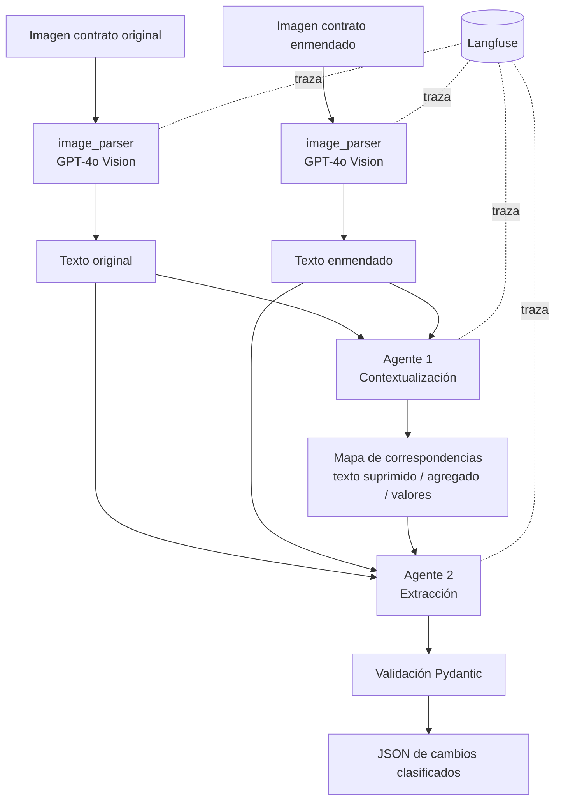

# Agente de Comparación de Contratos

Sistema multi-agente que compara dos versiones de un contrato a partir de sus imágenes
escaneadas, identifica los cambios entre ellas, los clasifica y devuelve un resumen
estructurado y validado, con trazabilidad completa de cada llamada al modelo.

Desarrollado para el caso de LegalMove, una firma legal cuyo equipo de Compliance revisa
manualmente enmiendas contractuales recibidas como documentos escaneados.

---

## Qué resuelve

El equipo recibe un contrato y su enmienda como imágenes. Alguien debe leer ambos, ubicar
qué cláusulas se corresponden, detectar qué cambió y evaluar si el cambio altera
obligaciones. Es trabajo lento, y el error más costoso no es pasar por alto un monto: es
pasar por alto una palabra suprimida dentro de una cláusula reformulada.

El sistema automatiza la detección y la clasificación. La decisión sigue siendo humana:
la salida es un insumo auditable para el revisor, no un reemplazo de su criterio.

---

## Arquitectura



**Etapa de parsing.** Cada imagen se codifica en base64 y se envía a GPT-4o con un prompt
de transcripción literal. El modelo actúa como transcriptor, no como analista: no resume,
no corrige, y marca `[ILEGIBLE]` cuando no puede leer con certeza en lugar de completar.

**Agente 1 — Contextualización.** Alinea las secciones de ambos documentos y registra
mecánicamente las diferencias de cada par: texto suprimido, texto agregado y valores
modificados. No interpreta ni evalúa importancia.

**Agente 2 — Extracción.** Recibe los dos textos *más el mapa*, y sobre esa base
identifica cada cambio, lo clasifica y lo resume para un lector de Compliance.

**Validación.** La salida se estructura con `with_structured_output()` contra un modelo
Pydantic y se revalida explícitamente en el orquestador antes de entregarse.

---

## Instalación

Requiere Python 3.13, una clave de API de OpenAI y un proyecto en Langfuse.

```bash
git clone <url-del-repositorio>
cd PIM4

py -3.13 -m venv .venv
.venv\Scripts\activate          # Windows
# source .venv/bin/activate     # Linux / macOS

pip install -r requirements.txt
```

Copiar `.env.example` a `.env` y completar:

```
OPENAI_API_KEY=
LANGFUSE_PUBLIC_KEY=
LANGFUSE_SECRET_KEY=
LANGFUSE_HOST=https://us.cloud.langfuse.com
```

`LANGFUSE_HOST` debe apuntar a la región del proyecto: `us.cloud.langfuse.com` o
`cloud.langfuse.com`. Son instancias independientes y las credenciales no se comparten.

---

## Uso

```bash
python src/main.py <imagen_original> <imagen_enmienda> [--output archivo.json]
```

Ejemplo:

```bash
python src/main.py data/test_contracts/documento1_original.jpg data/test_contracts/documento1_enmienda.jpg
```

Imprime los cambios en consola y guarda el JSON en `outputs/`, con la fecha, el consumo
de tokens del parsing y el identificador de la traza de Langfuse correspondiente.

### Salida

```json
{
  "contrato_original": "data/test_contracts/documento1_original.jpg",
  "contrato_enmendado": "data/test_contracts/documento1_enmienda.jpg",
  "fecha_analisis": "2026-09-09T16:17:36",
  "trace_id": "925b9a85cdc674e383c90653199dbc9e",
  "cambios_detectados": 10,
  "analisis": {
    "changes": [
      {
        "change_type": "deletion",
        "summary": "Se eliminó la restricción de que la licencia sea 'intransferible'...",
        "sections_changed": ["1. Otorgamiento de Licencia"]
      }
    ]
  }
}
```

El `trace_id` enlaza cada resultado con la evidencia de cómo se produjo. Para una revisión
legal, poder ir del informe al registro de qué se le preguntó al modelo y qué respondió es
la diferencia entre un resultado y un registro auditable.

---

## Estructura

```
PIM4/
├── src/
│   ├── main.py                          Orquestador CLI y trazado
│   ├── image_parser.py                  Parsing multimodal
│   ├── models.py                        Modelos Pydantic de salida
│   └── agents/
│       ├── contextualization_agent.py   Agente 1
│       └── extraction_agent.py          Agente 2
├── data/test_contracts/                 Contratos de prueba
├── outputs/                             Resultados (ignorado por git)
├── validate_holdout.py                  Validación sobre conjunto reservado
├── NOTAS.md                             Registro de decisiones de diseño
├── requirements.txt
└── .env.example
```

---

## Decisiones técnicas

**Dos agentes, no uno.** Un solo agente que recibe ambos contratos debe alinear cláusulas
y analizar diferencias a la vez. Cuando hay secciones renumeradas o insertadas, el error
de alineación se arrastra al análisis. Separar la alineación produce un mapa explícito que
el segundo agente usa como punto de partida.

**Los agentes son cadenas LCEL con rol especializado, no agentes ReAct con herramientas.**
No hay herramientas externas que invocar, de modo que un bucle de razonamiento agregaría
latencia y no determinismo sin aportar capacidad. Son agentes en el sentido de rol
especializado con contrato de entrada y salida propio, no de bucle autónomo.

**GPT-4o en todo el pipeline, con `temperature=0` y `detail="high"` en visión.** En
`detail="low"` la imagen se comprime a 512×512 y se pierde texto pequeño; en un contrato,
perder un número es perder todo. Esa decisión cuesta el 48% del presupuesto de tokens del
pipeline, y es un costo asumido conscientemente.

**El mapa del agente 1 es mecánico, no interpretativo.** Una nota en prosa del tipo
"cambio en el alcance de la licencia" ancla al agente 2 en esa lectura y le hace pasar por
alto otras diferencias del mismo par. Tres listas crudas obligan a que toda supresión
quede visible.

**Un objeto por cambio.** Una enmienda puede contener adiciones, eliminaciones y
modificaciones a la vez, de modo que un único tipo por documento sería inexacto. Además
permite que el revisor apruebe unos cambios y marque otros para revisión.

**Exhaustividad con una excepción.** Se reportan todos los cambios, incluidos los formales
de título y preámbulo, indicando en el resumen cuándo un cambio no altera obligaciones. La
única excepción son las diferencias atribuibles a la transcripción —espaciado, comillas,
acentos—: no son cambios del documento sino de su lectura, y reportarlas sería afirmar
algo falso sobre un documento legal.

El detalle de cada decisión, con sus alternativas descartadas y el historial de iteración
de los prompts, está en [`NOTAS.md`](NOTAS.md).

---

## Validación

Los documentos 1 y 3 se usaron como conjunto de desarrollo: sobre ellos se iteraron los
prompts. El documento 2 no intervino en ninguna iteración y se reserva como conjunto de
validación, para distinguir un sistema que generaliza de uno sobreajustado a sus propios
casos de prueba.

La verdad de referencia se construyó comparando las transcripciones con `difflib`, un diff
determinista. Usar un LLM para generarla habría significado evaluar al modelo con su
propia tarea.

```bash
python validate_holdout.py
```

| Documento | Rol | Esperados | Detectados |
|---|---|---|---|
| 3 (SaaS) | Desarrollo | 4 | 4 |
| 1 (Licencia) | Desarrollo | 10 | 10 |
| 2 (Consultoría) | **Validación** | 7 | 7 |

El documento 2 produjo exactamente los cambios de su referencia, con los tipos correctos.

---

## Rendimiento y costo

Medido sobre el pipeline completo desde imágenes, por par de contratos:

| Métrica | Valor |
|---|---|
| Latencia total | ~12 s |
| Tokens | ~5.400 |
| Costo | ~$0,019 |
| Parsing de visión | 48% del costo |

A escala, mil pares de contratos cuestan menos de veinte dólares en llamadas al modelo.

---

## Limitaciones conocidas

**La transcripción varía entre corridas.** Con `temperature=0` la variación se reduce pero
no desaparece. Se observó una corrida que unió dos palabras del preámbulo. No afectó la
detección de cambios, pero un sistema en producción debería comparar transcripciones
repetidas antes de dar por firme el texto extraído.

**La granularidad de la salida no es determinista.** Dos corridas sobre el mismo documento
produjeron 9 y 10 cambios. La diferencia no es de contenido: en una, dos calificadores
suprimidos en la misma cláusula se agruparon en un solo objeto y en la otra se separaron.
Ambas lecturas son válidas. Para uso en producción, el conteo de cambios no debe tratarse
como una cifra estable.

**Sin verificación cruzada de la transcripción.** Si el modelo de visión lee mal un monto,
nada en el pipeline lo detecta. Un sistema en producción debería transcribir cada imagen
dos veces y comparar, o exigir revisión humana de los valores numéricos.

**Probado sobre contratos de una sola página, en español, con cláusulas numeradas.** No se
evaluó su comportamiento con documentos multipágina, con cláusulas sin numerar, ni con
escaneos de baja calidad o inclinados.

**El sistema no evalúa riesgo legal.** Clasifica y resume cambios; no dictamina si un
cambio es aceptable, ni prioriza por gravedad. Esa lectura sigue siendo del equipo de
Compliance.

---

## Stack

Python 3.13 · OpenAI (GPT-4o, visión y texto) · LangChain · Pydantic · Langfuse
